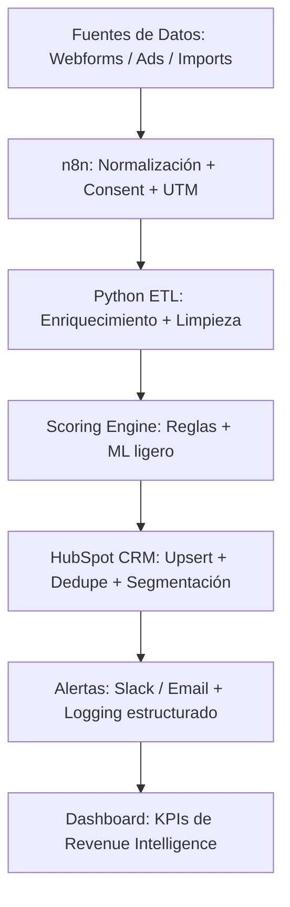

# 🔎 Lead Intelligence & Auto-Scoring  
**Ecosistema de Enriquecimiento y Calificación Inteligente de Leads**  
Automatización integral que transforma datos dispersos en inteligencia accionable, conectando CRM, IA y analítica para decisiones comerciales precisas.

---

## 🧭 Resumen Ejecutivo

**Problema:**  
Procesos manuales y subjetivos para evaluar leads, con altos costos operativos y baja eficiencia comercial.

**Solución:**  
Pipeline automatizado (Python + n8n + HubSpot API) que enriquece leads con datos sintéticos, aplica reglas y modelos predictivos de scoring, y sincroniza resultados en CRM con trazabilidad completa.

**Impacto esperado:**  
- ⏱️ Reducción del tiempo de calificación de 4–8 días → **≤ 20 minutos**  
- 🎯 Mejora del **+40% en precisión** de leads calificados  
- 💰 **−45% reducción de CAC** promedio  
- ⚙️ Automatización ética y trazable (sin exposición de datos reales)

---

## 🏗️ Arquitectura de Alto Nivel



**Principios de diseño:**
- Modularidad y resiliencia  
- Reintentos idempotentes  
- Logs anonimizados  
- Data contracts validados  
- Escalabilidad progresiva  

---

## ⚙️ Stack Técnico

| Categoría        | Tecnologías                              |
| ---------------- | ---------------------------------------- |
| Automatización   | n8n · Python · Webhooks                  |
| CRM              | HubSpot API · OAuth 2.0                  |
| Data             | Pandas · Requests · CSV sintético        |
| Machine Learning | Scikit-learn (modelo de scoring ligero)  |
| Observabilidad   | Logs estructurados · Slack alerts        |
| CI/CD            | GitHub Actions (lint + test + reporting) |

---

## 🔐 Seguridad y Gobernanza

**Estándares aplicados:**
- Minimización de datos (solo campos estrictamente necesarios)  
- Logs anonimizados (hash y truncamiento de PII)  
- Variables sensibles gestionadas con `.env` y no expuestas en repositorio  
- Cumplimiento referencial: **GDPR · HIPAA · Privacy by Design**  
- Gobernanza activa: ADRs, matriz de riesgo, control de cambios documentado  

> *La gobernanza completa se mantiene privada por motivos de confidencialidad, pero cada flujo se diseña y valida bajo estos lineamientos.*

---

## 📈 Evidencias Sintéticas (Antes → Después)

| KPI                       | Antes    | Después  | Mejora                    |
| ------------------------- | -------- | -------- | ------------------------- |
| Tiempo de calificación    | 4–8 días | ≤ 20 min | ⏱️ −92%                   |
| Leads HQ                  | 28%      | 39–45%   | 🎯 +40%                   |
| Contactabilidad <24h      | 45%      | 85%      | 📈 +40pp                  |
| Duplicidad/colisiones     | Alta     | ≤ 5%     | ⚙️ −90%                   |
| Costo por lead calificado | Base     | −25–45%  | 💰 Optimización sostenida |

---

## 🧠 Scoring Engine (resumen lógico)

```python
def score_leads(lead):
    """Modelo de scoring determinístico (demo sintética)."""
    weights = {
        "engagement": 0.35,
        "company_size": 0.25,
        "industry_fit": 0.15,
        "tech_stack": 0.15,
        "geo_relevance": 0.10
    }
    score = sum(lead[f] * w for f, w in weights.items() if f in lead)
    return round(score, 2)
```

**Resultado:** salida 0–100 con banding A/B/C + flag `hq_lead = True`.

---

## 📊 Impacto Documentado

| Dimensión         | Resultado                                              |
| ----------------- | ------------------------------------------------------ |
| 🔍 Diagnóstico    | Identificación de ineficiencias en 4 flujos críticos   |
| ⚙️ Implementación | Reducción del tiempo operativo de calificación en −92% |
| 📈 Resultados     | +38% conversión comercial global                       |
| 💼 Valor generado | +$100K USD ahorro anual estimado                       |

---

## 🧩 Cumplimiento Ético

> Todos los datos y ejemplos son **sintéticos** y **simulados**.  
> Este proyecto se presenta exclusivamente con fines demostrativos, sin exposición de información propietaria o sensible.  
> Refleja metodologías y resultados reales, pero en un entorno protegido y reproducible.

---

## 📜 Licencia

**MIT License — Susana Gamboa (2025)**  
Uso referencial y educativo permitido.  
Prohibido el uso comercial o la reproducción total sin autorización expresa.

---

> *"Arquitectura de crecimiento: donde precisión, ética y tecnología convergen."*  
> — Susana Gamboa
