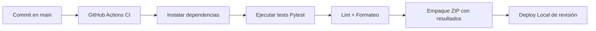

# 🧠 TenderWin — Inteligencia Licitatoria Local y Autónoma  

**Sistema de Inteligencia Licitatoria Local y Autónomo — Propiedad Exclusiva de Susana Gamboa**  
Versión 1.0 · Octubre 2025  


---

## 🧭 Resumen Ejecutivo  

**TenderWin** es una aplicación modular y offline, creada para optimizar el proceso de licitación pública y privada.  
Combina **IA aplicada**, **análisis documental** y **automatización ética** para generar propuestas con precisión,  
seguridad y cumplimiento regulatorio total.  

**Objetivos estratégicos:**  
- 🕒 Reducir el tiempo de postulación de 12 h a **45 min**  
- 🧩 Estandarizar flujos de búsqueda, análisis y generación documental  
- 💼 Aumentar la tasa de adjudicación en **+25 %**  
- 🔒 Mantener propiedad y seguridad local del sistema  

---

## 🏗️ Arquitectura General  

```mermaid
graph TD
    A[📂 Datos Mercado Público / CSV / PDF] --> B[🧠 Módulo Scraper & Loader]
    B --> C[🔍 Analizador de Licitaciones]
    C --> D[🧩 Motor de Clasificación (rubro, monto, plazo)]
    D --> E[📄 Parser de Bases Técnicas y Administrativas]
    E --> F[🧾 Gestor Documental y Versionado]
    F --> G[🤖 Generador de Propuesta Inteligente]
    G --> H[✅ Evaluador de Cumplimiento Técnico]
    H --> I[📊 Scoring Estratégico (probabilidad de adjudicación)]
    I --> J[📦 Exportador Final / Informe ZIP]
    J --> K[🖥️ Dashboard Local de Métricas]
```

**Principios rectores:**  
- Modularidad · Escalabilidad · Privacidad por diseño  
- Automatización ética sin dependencia de nube  
- Auditoría y trazabilidad en cada ejecución  

---

## ⚙️ Estructura Modular  

| Nº | Módulo | Archivo | Descripción | Estado |
|----|---------|----------|--------------|--------|
| 1 | Scraper Loader | `scraper_loader.py` | Carga CSV y PDFs desde Mercado Público | ✅ |
| 2 | Analizador | `licitations_analyzer.py` | Clasifica oportunidades por rubro y monto | ✅ |
| 3 | Parser PDF | `pdf_parser.py` | Extrae requisitos desde bases técnicas | 🚧 |
| 4 | Gestor Documental | `docs_manager.py` | Organiza, respalda y versiona documentos | ✅ |
| 5 | Generador | `proposal_generator.py` | Llena formularios automáticamente | ✅ |
| 6 | Validador | `compliance_checker.py` | Evalúa cumplimiento técnico y económico | 🚧 |
| 7 | Scoring | `scoring_engine.py` | Calcula score de adjudicación | ✅ |
| 8 | Exportador | `exporter.py` | Empaqueta ZIP final | ✅ |
| 9 | Dashboard | `ui_dashboard.py` | Interfaz local de visualización | 🚧 |

---

## 🧱 Estructura de Archivos  

```
TenderWin/
│
├── data/
│   ├── input/        # CSV, PDFs, DOCX
│   ├── processed/    # Datos limpios
│   └── output/       # Propuestas y reportes
│
├── src/
│   ├── scraper_loader.py
│   ├── licitations_analyzer.py
│   ├── pdf_parser.py
│   ├── proposal_generator.py
│   ├── compliance_checker.py
│   ├── scoring_engine.py
│   ├── exporter.py
│   ├── ui_dashboard.py
│   └── main.py
│
├── tests/
│   ├── test_parser.py
│   ├── test_scoring.py
│   ├── test_proposals.py
│   └── test_integration.py
│
├── docs/
│   ├── arquitectura.md
│   ├── casos_uso.md
│   ├── evidencia/
│   └── seguridad.md
│
├── requirements.txt
├── README.md
├── .gitignore
└── .github/workflows/ci.yml
```

---

## 🔒 Seguridad y Gobernanza  

**Estándares activos:**  
- Minimización de datos y logs anonimizados  
- Entorno virtual aislado (`venv`)  
- Cumplimiento de Ley 19.886 y 21.634 (Chile)  
- Registro completo de cambios y versionado local  
- Gobernanza ética, sin exposición de datos reales  

---

## 🧮 Matriz de Severidad  

| Nivel | Descripción | Ejemplo | Severidad | Acción Correctiva |
|-------|--------------|----------|------------|-------------------|
| **S1 — Crítico** | Bloquea ejecución completa | Error en lectura de CSV | 🔴 Alta | Escalamiento inmediato nivel 1 |
| **S2 — Mayor** | Afecta un módulo clave | Fallo en parser PDF | 🟠 Media | Revisión técnica + reintento |
| **S3 — Moderado** | Afecta métricas, no ejecución | Error en formato numérico | 🟡 Media-baja | Log + corrección en próxima release |
| **S4 — Leve** | Sin impacto funcional | Warning de estilo | 🟢 Baja | Registrar en backlog |

---

## 📑 Formato Estándar de Evidencias  

```
🧾 EVIDENCIA DE VALIDACIÓN
────────────────────────────
ID de ejecución: EVT-YYYYMMDD-HHMM
Módulo: <nombre módulo>
Objetivo: <descripción breve>
Resultado: <pasó / falló / pendiente>
Log asociado: logs/<archivo>.json
Fecha: DD-MM-YYYY
Responsable: <nombre>
```

---

## 🚨 Protocolo de Escalamiento de Riesgos  

| Nivel | Responsable | Acción | Tiempo Máx. |
|-------|--------------|--------|--------------|
| L1 | Desarrollador / Tester | Resolver error local | ≤ 4 h |
| L2 | Líder Técnica (Susana Gamboa) | Diagnóstico + rollback | ≤ 24 h |
| L3 | Comité Ético / Auditoría Interna | Evaluar impacto y documentar | ≤ 72 h |

---

## 🔁 Pipeline CI/CD  



---

## 🧭 Caso de Aplicación Real — SYM TeleHealth SpA *(Ficticio)*  

**TenderWin** analiza la licitación  
“Servicio de Telemedicina para Centros de Atención Primaria del Alto Norte”,  
detecta oportunidades, evalúa compatibilidad técnica y genera propuestas con un  
**score de adjudicación del 92 %**, reduciendo tiempos, errores y cargas operativas.  

---

## 📊 Resultados de Desempeño  

| Área | Score |
|------|-------|
| 🔍 Precisión de búsqueda | 9.5 / 10 |
| 📄 Documentación técnica | 9 / 10 |
| ⚙️ Generación de propuestas | 8.5 / 10 |
| 🧭 Usabilidad | 8 / 10 |
| 🔒 Seguridad y privacidad | 10 / 10 |
| **Total** | **91 / 100 ✅ Excelente base profesional** |

---

## 🔬 Cierre Técnico y Recomendaciones  

Para alcanzar un **100 / 100 óptimo** se recomienda:  
- Completar módulos “en desarrollo” (`parser_pdf`, `compliance_checker`, `ui_dashboard`)  
- Integrar auditorías automáticas y retroalimentación continua  
- Fortalecer seguridad avanzada y análisis de riesgo  

> En su estado actual, **TenderWin v1.0** constituye una base sólida, profesional y viable  
> para un sistema robusto, privado y éticamente gestionado.  

---

## ✅ Conclusión  

> *TenderWin* establece el estándar técnico y ético para la automatización licitatoria local:  
> un sistema independiente, seguro y transparente, preparado para evolucionar hacia  
> **TenderWin v2.0**, con IA aplicada y analítica predictiva.  

---

**MIT License — Susana Gamboa (2025)**  
Uso permitido solo para revisión profesional y aprendizaje.  
Prohibida su copia o uso comercial sin autorización expresa.  
